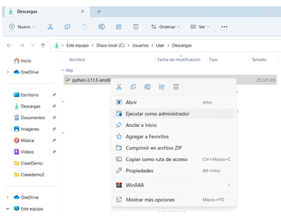
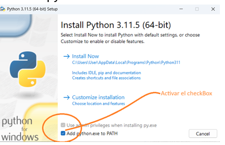
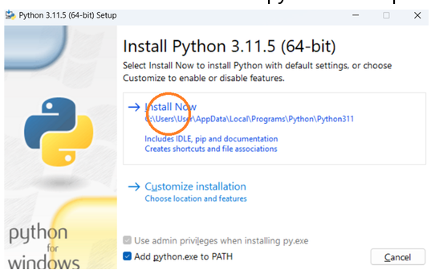

# Instalar python

pasos para instalar python

## 🪟  Windows

1. Ir a la página oficail de python https://www.python.org/downloads/  e instalar la `versión 3.14.4` para no tener incovenientes
2. Ejecutas el instalador

    

3. Activar el checkbox de la primara pantalla del instalador.

    

4. Dar click en install now

    

5. Esperar que se instale y cierras el instalador.

6. Abres la terminal de windows
    - Lo puedes buscar en la biblioteca de aplicaciones
    - Pulsas las teclas `Win` + `R` luego escribes `cmd` 

7. En la terminal verificamos la instalación y que versión se tiene de python

    ```bash
        py --version
    ```

--- 

## 🐧 Linux - Ubuntu

1. Abres la termial
     - Lo puedes buscar en la biblioteca de aplicaciones
    - Pulsas las teclas `Alt` + `Ctrl` + `T`

2. Ejecutas este comando

```bash
    sudo apt install python3
```

3. Verficamos la versión que ahora se tiene

```bash
    python3 --version
```