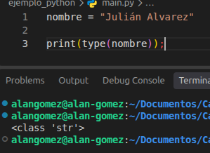
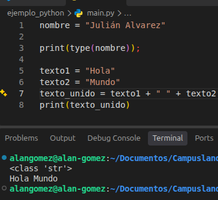

# 🧮 Variables

## ¿Qué es una variable?

Una variable es como una **caja con nombre** donde guardas un dato para usarlo después. Ese dato puede ser un número, un texto, un verdadero o falso, etc.

```python
edad = 26
```

Aquí la caja se llama `edad` y adentro guarda el número `26`.

---

## Tipos de datos básicos

| Tipo de dato | Nombre en Python | ¿Qué guarda? | Ejemplo |
|--------------|------------------|--------------|---------|
| Booleano | `bool` | Solo puede ser verdadero o falso | `True`, `False` |
| Entero | `int` | Números sin decimales | `1`, `26`, `-5` |
| Decimal | `float` | Números con punto decimal | `9.99`, `0.12` |
| Texto (cadena de caracteres) | `str` | Palabras o frases, siempre entre comillas | `"Hola, ¿cómo estás?"` |

### 📌 ¿Y las constantes?

Una constante es un valor que **no debería cambiar** mientras corre el programa, como el porcentaje del IVA.

En Python no existen constantes "de verdad", así que se usa una costumbre: escribir el nombre **en mayúsculas**. Así cualquiera que lea el código sabe que ese valor no se toca.

```python
IVA = 0.12
```

---

## ¿Cómo declarar una variable en Python?

Solo necesitas un nombre, el signo `=` y el valor:

```
nombre_variable = valor
```

**✅ Ejemplo**

```python
nombre = "Julián Alvarez"   # texto (str)
edad = 26                   # número entero (int)
futbolista_activo = True    # booleano (bool)
```

> 💡 En Python los nombres de variables se escriben en minúsculas y con guion bajo para separar palabras: `futbolista_activo`.

---

## ¿Cómo saber qué tipo de dato es una variable?

Usando las variables del ejemplo anterior, puedes preguntarle a Python con `type()`:

```python
print(type(nombre))
print(type(edad))
print(type(futbolista_activo))
```

Resultado en la terminal:

```
<class 'str'>
<class 'int'>
<class 'bool'>
```



---

## Unir textos (concatenar)

Puedes unir varios textos usando el signo `+`:

**✅ Ejemplo**

```python
texto1 = "Hola"
texto2 = "Mundo"
texto_unido = texto1 + " " + texto2

print(texto_unido)
```

Resultado en la terminal:

```
Hola Mundo
```



> 💡 El `" "` del medio es un espacio. Sin él, el resultado sería `HolaMundo`.

### Una forma más fácil: f-strings 

Si pones una `f` antes de las comillas, puedes meter variables directamente dentro del texto usando llaves `{}`, a esto se le llama formateo:

```python
nombre = "Julián"
edad = 26

print(f"{nombre} tiene {edad} años")
```

Resultado en la terminal:

```
Julián tiene 26 años
```

> ⚠️ Con `+` no puedes unir texto con números directamente: `"Edad: " + 26` da error. Con f-strings no tienes ese problema.