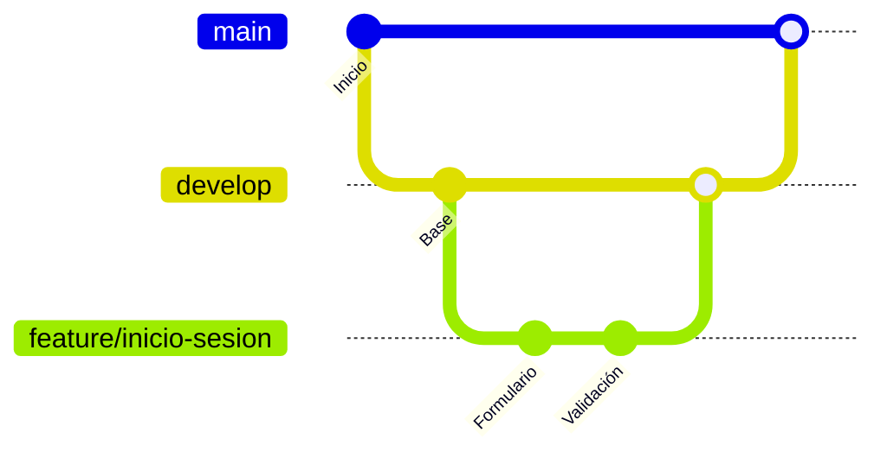

# Guía Git 

## ¿Qué es Git?

Git es una herramienta que guarda un **historial de todos los cambios** de un proyecto. Gracias a eso puedes ver cómo estaba el código antes, saber quién cambió qué y regresar a una versión anterior si algo sale mal.

> **Git y GitHub no son lo mismo.**
> Git es la herramienta que guarda el historial en tu computadora.
> GitHub es una página donde guardas ese proyecto en la nube para compartirlo con tu equipo.

---

## Repositorios

Un **repositorio** es la carpeta de tu proyecto, pero con algo especial: además de los archivos, guarda todo el historial de cambios.

Hay dos tipos:

| Tipo | ¿Dónde está? | ¿Para qué sirve? |
|------|--------------|------------------|
| **Local** | En tu computadora | Aquí trabajas. Lo que guardas aquí solo lo ves tú. |
| **Remoto** | En la nube (por ejemplo, GitHub) | Aquí se comparte el proyecto con el equipo. Es como Google Drive, pero para desarrolladores. |

---

## Commits

Un **commit** es como una foto de tu proyecto en un momento específico. Cada commit lleva un mensaje que explica qué cambiaste, y siempre puedes regresar a esa foto.

### ¿Y qué es el "stage"?

Imagina que vas a enviar un paquete:

1. 📦 Con `git add` metes cosas en la caja (eso es el **stage**).
2. 🏷️ Con `git commit` cierras la caja y le pones una etiqueta con lo que contiene.
3. 🚚 Con `git push` la envías a GitHub.

---

## Ramas

Imagina un árbol. El tronco es la rama principal, y ahí vive el código que ya funciona bien. A esa rama se le llama **main**.

Como no queremos arriesgarnos a dañar el tronco, casi nunca trabajamos directamente en él. Para eso existe otra rama llamada **develop**. Piensa en ella como un espacio de pruebas: ahí se juntan los cambios nuevos, y solo cuando todo está bien, se pasan a main.

Cuando quieres hacer algo nuevo, por ejemplo agregar un inicio de sesión, no lo haces directo en develop. Creas una rama pequeña que sale de develop, solo para ese cambio. A estas ramas les ponemos un nombre que empieza con **feature/** (que en inglés significa "característica") seguido de lo que vas a hacer:

```
feature/inicio-sesion
```

Cuando terminas tu cambio y funciona, esa rama se une de regreso a develop. Y cuando develop está lista y probada, se une a main.



*Cada punto del diagrama es un commit.*

> 💡 Usar `main`, `develop` y `feature/` es una forma de organizarse que usamos en el equipo, no una regla obligatoria de Git.

---

## Comandos principales

| Comando | ¿Qué hace? |
|---------|------------|
| `git clone <url>` | Descarga un repositorio remoto a tu computadora. |
| `git status` | Muestra qué archivos cambiaste o creaste. |
| `git add .` | Prepara todos los cambios para el commit (los mete al stage). |
| `git commit -m "mensaje"` | Guarda los cambios del stage en el historial con un mensaje. |
| `git push` | Sube tus commits al repositorio remoto. |
| `git pull` | Trae lo nuevo del repositorio remoto y actualiza tu repositorio local. |
| `git branch` | Muestra las ramas que existen. |
| `git branch nombre-rama` | Crea una rama, pero **no** te mueve a ella. |
| `git switch nombre-rama` | Te cambia a otra rama. |
| `git switch -c nombre-rama` | Crea una rama y te mueve a ella de una vez. |
| `git merge nombre-rama` | Une los cambios de otra rama a la rama donde estás. |
| `git branch -d nombre-rama` | Elimina una rama. |
| `git log --oneline` | Muestra la lista de commits, uno por línea, con su mensaje. |
| `git init` | Iniacializa un repositorio local|

---

## Detalles importantes

**Para hacer un merge, primero ubícate en la rama que va a recibir los cambios.**

```bash
git switch develop
git merge feature/inicio-sesion
```

Esto trae los cambios de `feature/inicio-sesion` hacia `develop`.

**`git push -u origin` solo se usa la primera vez** que subes una rama nueva. `origin` es el nombre que Git le da al repositorio remoto.

**`git checkout -b`** hace lo mismo que `git switch -c`. Es la forma antigua, pero la vas a ver mucho en tutoriales.

**Haz `git pull` antes de empezar a trabajar** para no trabajar sobre código viejo.