# Pasos del uso de git

Sigue las siguientes instrucciones para el uso de git flow.


## Pasos 👣

### 1. Creación de repositorio en GitHub

Crea un repositorio en git hub en el boton de nuevo repositorio (Repositorio remoto)
    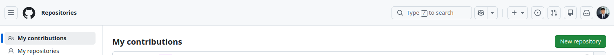
    Luego debes de agregarle un nombre al repositorio

    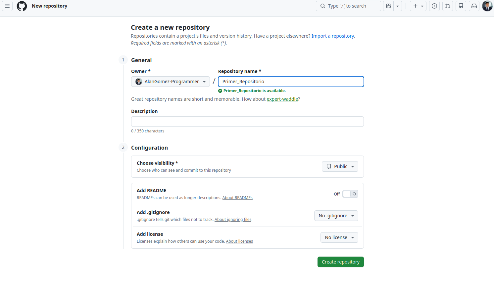
    obtendras un nuevo repositorio
    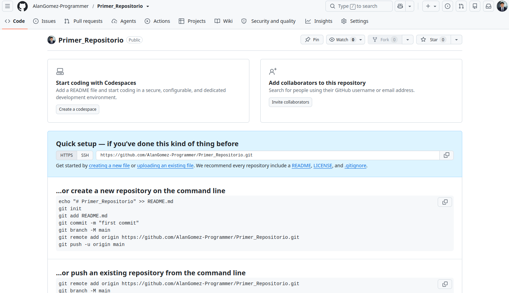

---

### 2. Tener el repositorio en la computadora

Ve a la terminal de tu computadora

- windows: buscas `Terminal` o presionas `Win` + `R` y escribes `cmd`

- Linux: Buscar `Terminal` o presionas las teclas `Alt` + `Ctrl` + `t`


Luego en la terminal escribes el siguiente comando.

```bash
    git clone url_respositorio
```

> agregas la url que esta en la página donde realizaste tu repositorio remoto, copias y pegas en el comando.

**Ejemplo:**  En la imagen se ve que me dan el siguiente url y es el que se debe de copiar 

```bash
    git clone https://github.comAlanGomez-ProgrammerPrimer_Repositorio
``` 

al momento de dar `enter` en el teclado veras en tus archivos la carpeta con el nombre del repositorio remoto.

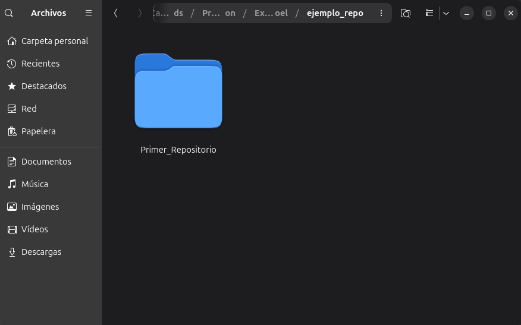

   
---

### 3. Ejemplo de flujo de uso de git (git flow)

Empezamos a crear un mini ejercicio

> **Recomendación**
> 
> Para inicial bien la rama `main` creamos el README.md ya que es donde se indica de que se trata el proyecto.

-  Creamos el archivo `README.md` y agregamos un titulo para hacer el primer commit recomendado

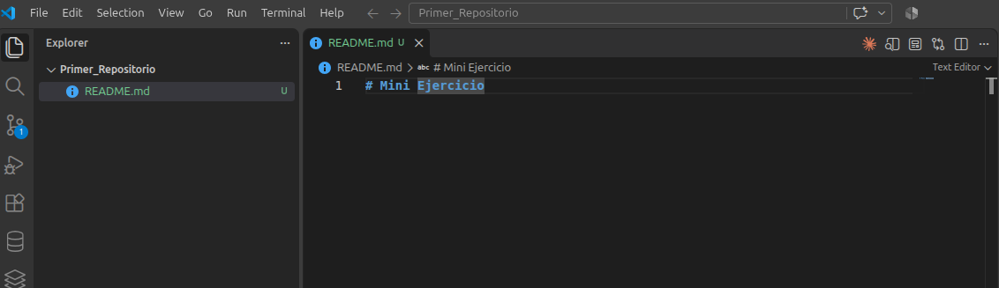
    
luego vamos en el icono de puntos

- Agregamos el `README.md` de changes y luego se vera en el **Staged Changes**

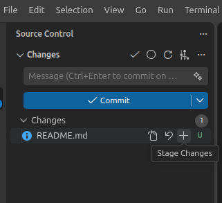

- Luego en el icono del criculo (conventional commit)

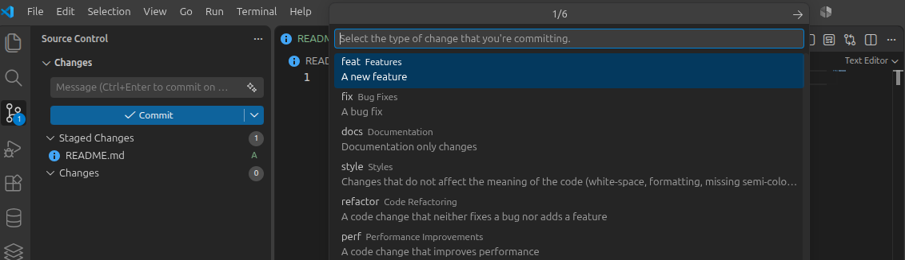

y en el conventional commit sigue estos pasos:
    
1. buscar o escribir: `docs`
2. en siguiente paso, presiona en None
3. busca :memo: y lo presionas
4. escribe el primer commit: `Commit inicial`
    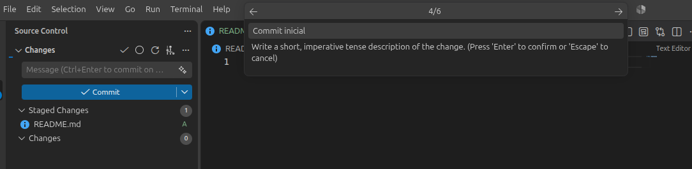
5. luego enter y enter.

- Después presionas el boton `Publish Branch` 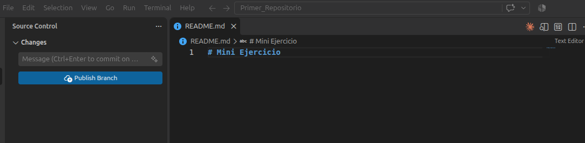o agregas el comando.

```bash
    git push -u origin main
```

- luego refrescas en la página de github y puedes visualizar que ya esta subido el README.md

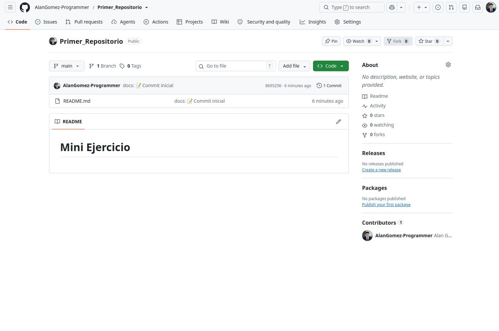

--- 

### 4. Creación de la Rama Develop

Creamos la rama develop

- Creamos la rama `Develop` con el siguiente comando.

```bash
    git branch  develop
```

- luego se dirige a la nueva rama `Develop`.

```bash
    git switch develop
```

- para verificar que estas en la rama correcta ejecuta debes de ejecutar el comando 

```bash
    git branch
```

tendras que ver 

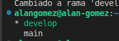

y ver que el simbolo `*` este en la rama develop.


- Creamos un archivo `.text`

    > para este ejercico se creara un archivo `.txt` solo para editar texto para comprender bien que es lo que pasa.

    - Teniendo en cuenta lo anterior, creas el archivo .text como `ejemplo.txt`

    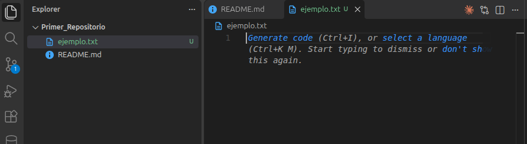

    puedes ver que en el nuevo archivo se puede ver la `u` que quiere Untracked, eso significa que es archivo nuevo.

    - Agregas el archivo en el `staged changes`
    - creas el commit pero con una modificacion.
    - ahora en el convenitonal commit sigues estos pasos
    1. pulsas en `feat` ya que significa que es una nueva caracteristica o es algo nuevo
    2. pulsas None
    3. pulsas en `:sparkles:` 
    4. En comentario corto puesdes agregar: Archivo de texto agregado.

    en el git graph te debe de aparecer de la siguient emanera:

    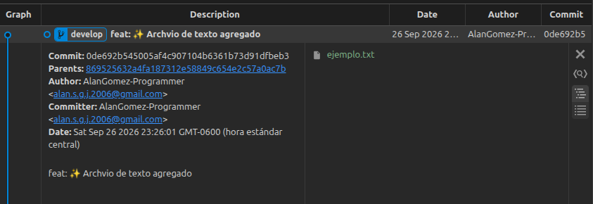

---

### 5. Creación de las ramas necesarioas

Luego de tener la rama main y develop, 

> **Recordatorios**
>
> 1. Para las ramas de modificación tiene que venir de la rama `Develop`, por lo tanto debes estar en la rama develop.
>
> 2. A estas nuevas ramas se pone `feature/` antes del nombre 

- Creamos la primera rama que nos ayudara a crear la primera linea de texto

    ```bash
        git checkout -b feature/primer-texto
    ```
    Recuerda que el `checkout -b` crea el archivo y nos dirige a esa rama

- agregas el primer texto

    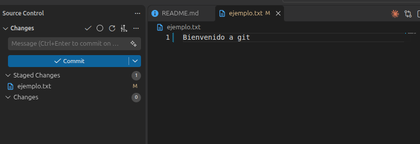

    Ahora puedes ver que en el archivo esta la letra `M` que quire decir que ese arhcivo esta siendo modificado.

- Haces el commit con los mismos pasos del commit anterior ya que es una nueva caracteristica, solo que en el comentario se cambia a: Se agrega el primer texto 

    Quedaria de la siguiente manera:

    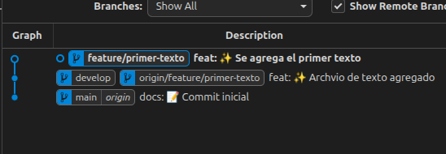

- regresas a la rama develop y creas una nueva rama, llamada `feature/segundo-texto` y agregas el texto que desees.
- Luego haces el commit con el comentario de: Se agrega el segundo texto

---

>📌 **Importante**
>
> Visualiza la imagen o visualiza tu git graph
>
> 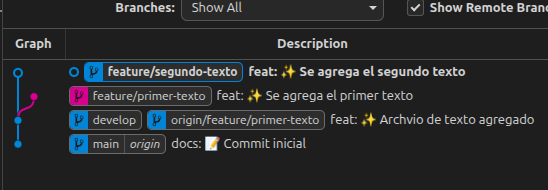
>
> **¿Qué ves de nuevo?**
>
> Hay un nuevo color, eso significa que hay rama. ¿Que siginifica?
> 
> El ultimo commit (segundo-texto) se adelanto al commit (primer texto) esto quiere decir que la rama de `feature/primer-texto` quedo en el pasado con el texto que se agregó ahi, mientras la nueva rama `feature/segundo-texo` se adelanto.

- Regresa a la rama develop 
- Pudes ver que lo que hemos escrito no hay nada.

**¿Cómo se unen los textos que se agregaron al archivo?**
Se utiliza el comando `git merge`

Pero para hacer el git merge debes de estar en la rama `develop`

- ejecutas el comando para ver en que ramas estas

luego tienes que hacer por coordinación las uniones. Esto quiere decir que agregas primero el primerr `feature/` que se creó

con el siguiente commando

```bash
    git merge feature/primer-texto
```
luego tienes que unir la rama `feature/segundo-texto`.

Luego de unir la ramta de `freature/segundo-texto` visualizaras esto:

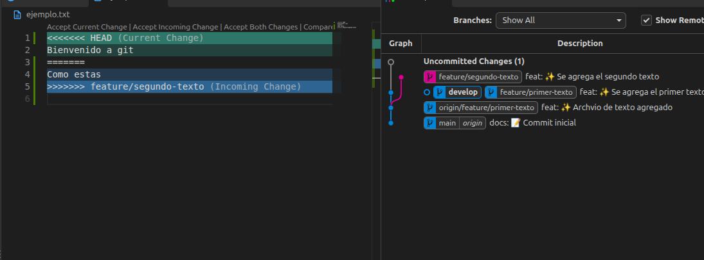

**¿Qué significa eso?**
Esto quiere decir que en las dos ramas se agregaron textos en la misma linea.
Pero no hay problema porque hay una solución para resolver este problema. 

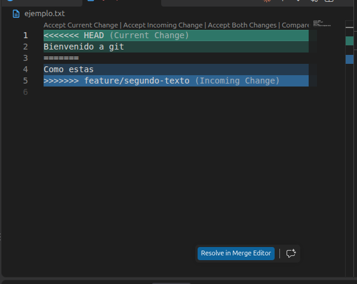

En la parte de abajo hay un boton que dice `Resolve in Merge editor`

al pulsar en el boton te mostrara estas pestañas:

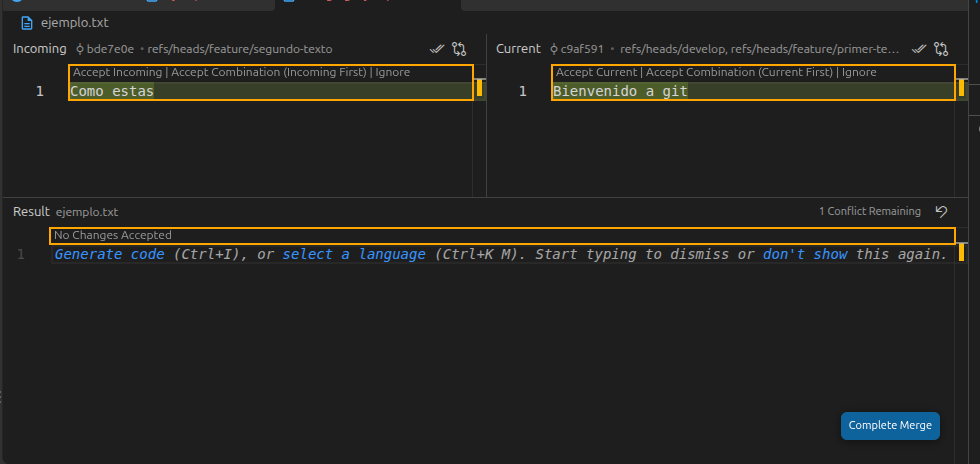

- **Parte izquierda:** En la parte izquierda se mostrara el texto nuevo que tiene la rama que se quiere unir. (La rama `feature/segundo-texto`)
- **Parte derecha:** En la parte derecha se mostrar el texto que se tenia anteriormente.

Para tener los dos textos en el archivo puedes pulsar el icono de dolbe check en la parate superior derecha de cada pestaña 

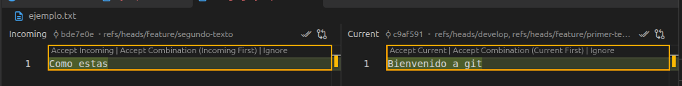

Si quieres que primero se visualize lo que ya estaba, pulsas el doble check que esta el parte derecha y luego el doble check de la parte izquierda.

**Ejemplo**

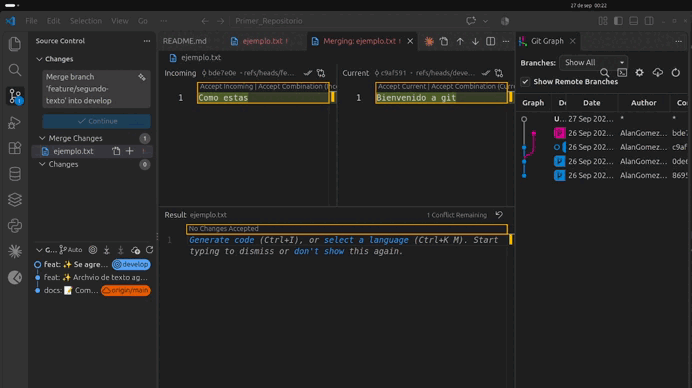

- Luego se te mostrar un mensaje de merge

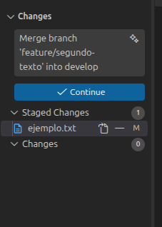

pulsas `Continue`

---

### 6. Resultado final

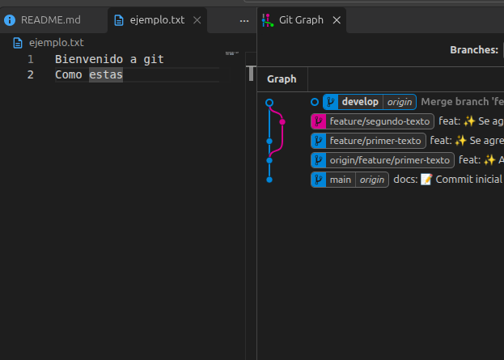

Ya tienes las ramas
- `main`
- `develop`
- `feature/primer-texto`
- `feature/segundo-texto`

Ahora en las ramas de develop ya tiens todo actualizado.

Ahora viene la parte más importante, al estar seguros de todo. (En este ejemplo ya esta todo bie)

Nos dirigimos a la rama `main` y unimos la rama `develop`

con el comando 

```bash
    git merge develop
```

con esto ya tenemos la rama `main` (la rama principal) actualizada con todo. 

- Visualizamos en el git graph si la rama main esta esta arriba y subimos todo al repositorio remoto con el comando 

```bash
    git push
```

con este comando se actauliza todo de la rama `main` en el repositorio remoto.


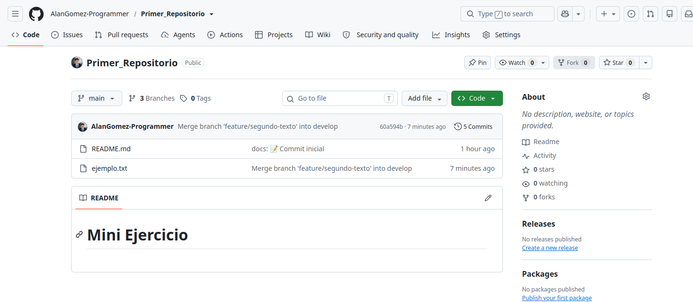

Ahi se puede visualizar el ultimo commit que se hizo que fue el del merge.

---

**¡¡Listo!!, ya puedes usar github ✨**